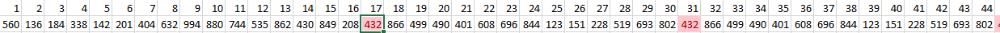

# PROGRAM-ID. randomize.

Middle-square pseudo-random number generator written in COBOL. Middle-square generators are statistically horrible, but fun from a historic perspective. The algorithm was the first PRNG to be rigorously described by none other than John von Neumann in 1949. The author himself is quoted as saying:

>"Anyone who considers arithmetical methods of producing random digits is, of course, in a state of sin."

This is generally something valuable to consider.

## Quick analysis

If we let this generator produce `100,000` numbers of `n=3` digits, based on timestamp as the seed, and plot them in a histogram with 49 buckets, we get this fun little chart:

We see clearly that the distribution is not even, it has huge gaps. When examining the series, it's trivial to spot that after 16 generations the 17:th generation starts a pattern of 14 repeating numbers:

Even for the untrained eye this does not look very random at all. The user can be fooled by increasing the length `n`, but statistically the algorithm is flawed. If you're unlucky you might even get repeating zeroes for ever.

## Run environment
* A computer a COBOL compiler
    * If time on a mainframe is hard to come by, a PC with GNUCOBOL works fine
    * Have a look at the devcontainer for Visual Studio Code
* An operator who wishes to generate a bunch of not-very-random numbers

## How to use
1. Compile code and run 
    * Hot tip: Run the accompanying Bash script by `./run.sh <digits>`
2. Run tests by compiling and executing some COBOL manually, or use the `test.sh` script
3. Success!

## License
All code licensed under GPL-3.0-only, license text in COPYING file in the repo root.

## Have fun
Please do.
